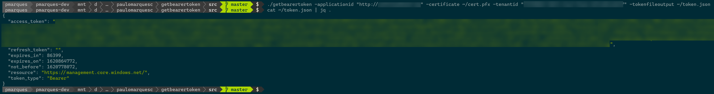

# getbearertoken.go
Golang tool that authenticates against Azure Active Directory using a certificate in pfx format and generates a token file.

## Usage

```
Usage of ./getbearertoken:
  -applicationid string
        service principal's application id
  -certificate string
        full path to the certificate, pfx-formatted, containing the certificate and private key to be used in the authenticaton process
  -pfxpassword string
        optional, pfx file password, it defaults to empty string
  -tenantid string
        service principal's tenant id
  -tokenfileoutput string
        full filename of the generated token
  -version
        shows current tool version
```

## Known Exit Error Codes

```golang
ERR_AUTH_CONFIG               = 2
ERR_AUTH_TOKEN                = 3
ERR_INVALID_ARGUMENT          = 4
ERR_CERTIFICATE_NOT_FOUND     = 5
```

## Execution Example

```bash
APP_ID=<YOUR APP ID>
TENANT_ID=<YOUR AAD TENANT ID>

./getbearertoken -applicationid $APP_ID -certificate ~/cert1.pfx -tenantid $TENANT_ID -tokenfileoutput ~/token.json
```

## Screenshot
